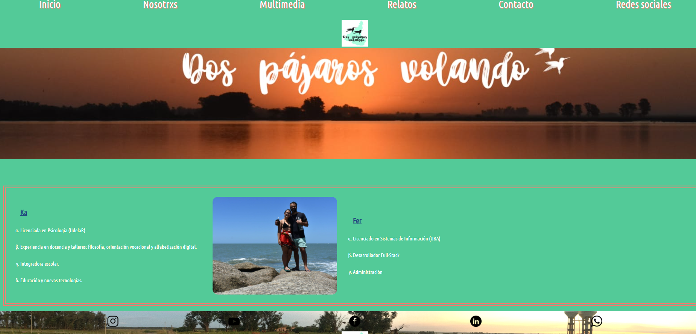

# Proyecto desarrollo web Dos Pajaros Volando(h1)

Este proyecto consiste en crear una pagina web desde 0 usando html y css.
Tecnologias usadas:
HTML5
CSS3
    GRID
    FLEXBOX
    BOX-SIZING
GIT
GITHUB

## Demo(h2)
Para probar mi sitio ingrese en :https://fmuzaber.github.io/DosPajarosVolando/

